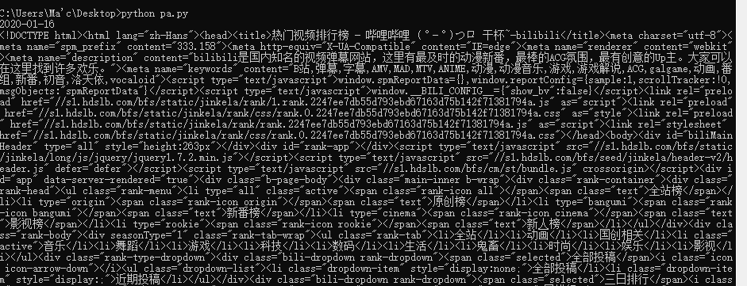
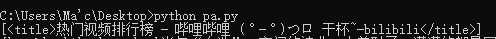
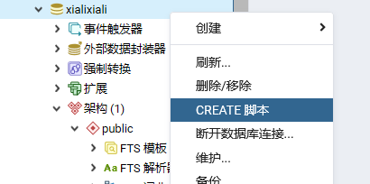
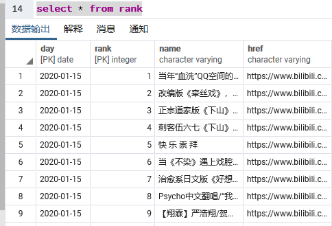

# python爬虫入门

爬虫实例：用python脚本爬取bilibili弹幕网上每日排行榜的榜单数据并把结果存储到postgreSQL数据库里。

简介：笔者新手，有一点python、postgreSQL以及html的知识，这也是本爬虫程序会涉及到的知识领域。
本程序相关的大部分内容都是笔者在CSDN论坛上看教程学的，在此算是整理笔记，小结一下。

> 相关网站：
> 1. 数据来源连接 [热门视频排行榜-哔哩哔哩——干锅](https://www.bilibili.com/ranking/all/0/0/3)
> 2. python3环境搭建 [python3|菜鸟教程](https://www.runoob.com/python3/python3-install.html)
> 3. postgreSQL数据库软件下载 [pgAdmin4下载-百度](https://www.baidu.com/s?ie=utf-8&f=8&rsv_bp=1&tn=80035161_2_dg&wd=pgAdmin4%E4%B8%8B%E8%BD%BD&oq=pgAdmin4%25E4%25B8%258B%25E8%25BD%25BD&rsv_pq=92da71b200042ff5&rsv_t=f349NcA5N6jm9fsGXMH7G1qe0mtU3mWF%2F3n84sFb75RHPBtaOXr%2FR%2FzSweOsiviQqHgIGQ&rqlang=cn&rsv_enter=0&rsv_dl=tb)


~~以上都是废话~~

## Table of Contents
1.  python爬虫逻辑
2.  代码
3.  获取单网页源码与多页源码
4.  [HTML](#html)
5.  [PostgreSQL](#postgresql)


## python爬虫逻辑

目前本新手所能理解的爬虫逻辑与其说是爬取网页数据，不如说是挑选出网页源代码中含有某些关键词的区块，再进行切割  

1. 先把目标网站的html代码原样不动地请求加载到本地：  

    
    
    （类似这样）  

2. 之后再引用某些python库对如上代码进行关键词索引，找到含有某些关键词的相关区块：  

    
    
    （查询"title"相关的区块） 

3. 最后对区块进行切割  


## 代码


新建python脚本 import 相关库  


```python
#!/usr/bin/python3
# -*- coding: UTF-8 -*-

import re
from bs4 import BeautifulSoup
import requests
import json
```

`re`：正则表达式（虽然我没用）

`BeautifulSoup`：索引HTML代码并返回关键词所在区块，切割区块也是用它。没装的用户可以:
 `pip install BeautifulSoup4`

`requests`：输入网页地址，返回网页源代码  

`json`：需要的朋友可以用此库把结果输出为json文件的格式


## 获取单网页源码与多页源码

```python
def get_one_page(url):
    response = requests.get(url)
    return response.text

html_doc =get_one_page("https://www.bilibili.com/ranking/all/0/0/3")

```

这样`html_doc`里储存的就是网页的源代码了。

多页/分页的网站：通过改变网页最末尾的几个数字型参数，很容易发现网页翻页了，或者说变了，
比如把如上网页中的`/0/0/3`改为`/3/1/1`,你会发现网页换了一页。由此我们可以创立list来存贮这些选项，
再通过遍历里面元素来完成多页的数据抓取。

```pydocstring
#list示例
>>> l1=["all","origin","bangumi","cinema","rookie"]
>>> l2=["0","1","168","3","129","4","36","188","160","119","155","5","181"]
>>> l3=["0","1"]
>>> l4=["1","3","7"]
>>> hr="https://www.bilibili.com/ranking"
>>> for i in l2:
...     href=hr+"/"+l1[0]+"/"+i+"/"+l3[0]+"/"+l4[0]
...     print(href)
...     # 可以通过类似的循环创造嵌套循环来遍历网页，python中好像没有case语句，
...     # 所以对于一些限制推荐用if语句代替
https://www.bilibili.com/ranking/all/0/0/1
https://www.bilibili.com/ranking/all/1/0/1
https://www.bilibili.com/ranking/all/168/0/1
https://www.bilibili.com/ranking/all/3/0/1
https://www.bilibili.com/ranking/all/129/0/1
https://www.bilibili.com/ranking/all/4/0/1
https://www.bilibili.com/ranking/all/36/0/1
https://www.bilibili.com/ranking/all/188/0/1
https://www.bilibili.com/ranking/all/160/0/1
https://www.bilibili.com/ranking/all/119/0/1
https://www.bilibili.com/ranking/all/155/0/1
https://www.bilibili.com/ranking/all/5/0/1
https://www.bilibili.com/ranking/all/181/0/1
```

使用BeautifulSoup库

```python
soup = BeautifulSoup(html_doc,'lxml')
```

以"lxml"（好像是某种格式吧）实例化html_doc，这样soup就是一个实例，soup.contents存储着网页源码  

使用开发者工具观察网页源码易发现（详情见下文的HTML部分），所有含有排名的div都属于名为"num"的class，运用关键词索引：

```pydocstring
>>> l1 = soup.find_all('div',attrs={'class':'num'})
>>> l1
[<div class="num">1</div>, <div class="num">2</div>, <div class="num">3</div>, <div class="num">4</div>, <div class="num">5</div>, <div class="num">6</div>,... <div class="num">96</div>, <div class="num">97</div>, <div class="num">98</div>, <div class="num">99</div>, <div class="num">100</div>]
```

现在我们只想要div区块中间的那个数字，试着这样做:

```pydocstring
>>> for i in l1[0]:
...     print(i)
1
```

由此我们得到了第一个div区块中间的文本，要得到第二个的只需将l1[0]中的参数0向上加1即可，要遍及所有的div再外套一个for循环即可  

同理，观察源代码发现所有的视频信息都存储在class为"title"的超链接标签a内

```pydocstring
>>> l2 = soup.find_all('a',attrs={'class':'title'})
>>> for i in range(len(l2)):
...     dic={}
...     for k in l2[i]:
...         dic["name"]=k.replace("'",'\"')
...     href =l2[i]["href"]
...     dic["href"]=href
...     print(dic)
{'name': '当年“血洗”QQ空间的神曲，太羞耻了，满满的都是回忆啊！', 'href': 'https://www.bilibili.com/video/av82724544'}
{'name': '改编版《牵丝戏》，倒放《西游记》这填词绝了！', 'href': 'https://www.bilibili.com/video/av80888974'}
{'name': '【官方】周深演唱《姜子牙》片尾曲MV发布啦', 'href': 'https://www.bilibili.com/video/av83422028'}
# ...
{'name': '在车站弹奏鬼灭之刃主题曲《红莲华》，围观的人会有多少？', 'href': 'https://www.bilibili.com/video/av78996367'}
{'name': '神级警告！！当指弹开唱，还有弹唱什么事？？《明日拂晓》（Pierre Bensusan《Demain Des Laube》）', 'href': 'https://www.bilibili.com/video/av82983151'}
```

这里的`l2[i]["href"]`是获取div内href的属性值，用这些的方法你可以获取到div中你想要的如何一种属性的参数值。
而`dic["name"]=k.replace("'",'\"')`则是替代掉标题中可能会出现表示物主代词的 `'` （单引号），
确保存储数据的字典全使用单引号，原因与数据库存储有关，会在下文`PostgreSQL`中提到。
而如需要字典输出string全用双引号包裹。。。。。。。~~笔者新手忘了怎么处理，百度可以查询到~~  

好像soup.find_all()的参数也可以用正则表达式来写，但笔者最近刚接触（大概）正则，还不太熟悉，不敢乱教。

本地日期的获取

长久爬取数据库，有时也要记录数据获取的时间，这里因为爬取的是当天数据，就用本地时间来代替了

```python
import time
localtime = time.asctime( time.localtime(time.time()) )
date=time.strftime("%Y-%m-%d", time.localtime())
print (date)
```

复制黏贴直接能用，就不多解释了，要了解的用户可以自行百度（( ﹁ ﹁ ) ~→笑）  


`Postgre`相关`python`代码


完整的百度psycopg2 python库，会有详细说明，这里就简单提一下
（原来是笔者写的课上作业，这里就直接搬了过来）

```python
import psycopg2 #引用的库

conn=psycopg2.connect(database=database, user=user, password=password) #依次：数据库名称，用户（管理者）账户名（一般就是默认的"postgres"）,账户密码（自己设置的密码）
cur = conn.cursor()
cur.execute("这里面写PostgreSQL的指令")

```

完整代码  

```python
#!/usr/bin/python3
# -*- coding: UTF-8 -*-

import re
from bs4 import BeautifulSoup
import requests
import json

import time
localtime = time.asctime( time.localtime(time.time()) )
date=time.strftime("%Y-%m-%d", time.localtime())
print (date)

def get_one_page(url):
    response = requests.get(url)
    return response.text

html_doc =get_one_page("https://www.bilibili.com/ranking/all/3/0/3")

soup=BeautifulSoup(html_doc,'lxml')
i=0
d=[]
l1=soup.find_all('div',attrs={'class':'num'})
l2=soup.find_all('a',attrs={'class':'title'})
while True:
    try:
        dic={}
        for m in l1[i]:
            dic["rank"] = m
        for k in l2[i]:
            dic["name"] = k.replace("'",'\"')
            #l1=re.findall(r'div class="num">(.?)*</div>',soup)
        href = l2[i]["href"]
        dic["href"] = href
        d.append(dic)
        i+=1
    except:
        for i in d:
            print(i)
        json_d = json.dumps(d,ensure_ascii=False)
        break

data=json.loads(json_d)
#print(data[0]["name"])

import psycopg2
import getpass

database='xialixiali'   #数据库的名称
user='postgres' #用户的名称
password=getpass.getpass('password:') #隐藏输入的密码

"""
database:xiapuxiapu_ganguo
user:postgres
password:
"""

conn=psycopg2.connect(database=database, user=user, password=password)  #connect to the database
cur = conn.cursor()
print("connect successfully")
#cursor.execute("insert into people values (%s, %s)", (who, age))

cur.execute("insert into Time(day) values (%r)" %(str(date)))    #execute() for entering one line command of SQL
print("Date enter")
for i in data:
    cur.execute("insert into rank(day,rank,name,href) values (%r,%r,%r,%r)" %(str(date),i["rank"],i["name"],i["href"]))
print("Data enter")
conn.commit()
conn.close()
input()
```

## **HTML**

打开浏览器，打开要抓取信息的网页，找到开发者工具。图片过程：  

  

点开后，用户就可以查看网页形成的源代码(巧用搜索功能能减少很多麻烦)：


emm,~~好像没啥的了~~

## **PostgreSQL**

笔者这里用的是`pgAdmin4`，百度下下载挺方便的，编程的语言是`PostgreSQL`，相关的问题在菜鸟教程上都有解答。
emm,~~那就好像没啥可写的了~~

放个`pgAdmin4`里建相关库的代码吧:

```postgreSQL
-- Database: xialixiali

-- DROP DATABASE xialixiali;

CREATE DATABASE xialixiali
    WITH 
    OWNER = postgres
    ENCODING = 'UTF8'
    LC_COLLATE = 'Chinese (Simplified)_China.936'
    LC_CTYPE = 'Chinese (Simplified)_China.936'
    TABLESPACE = pg_default
    CONNECTION LIMIT = -1;
	
CREATE TABLE Time(
	day date,
	primary key(day)
);
CREATE TABLE rank(
	day date,
	rank int not null,
	name varchar,
	href varchar,
	primary key(day,rank),
	foreign key (day) references Time
);
select * from Time
select * from rank
```

以及最终爬取数据后的效果：



用select语句查看结果：


